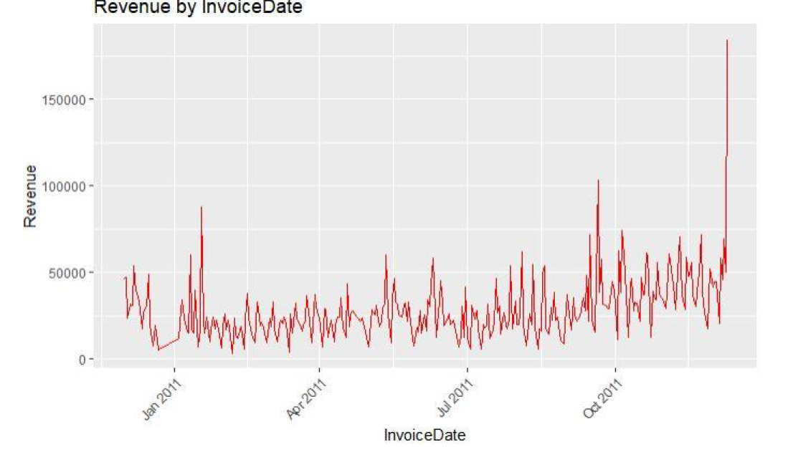
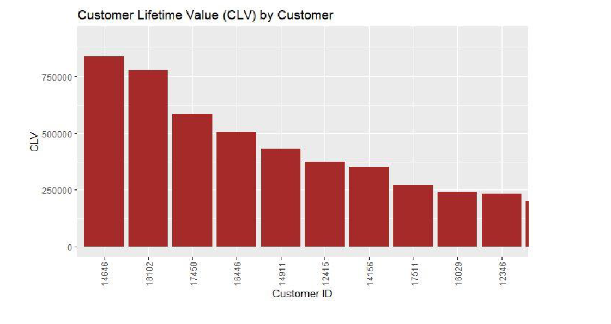
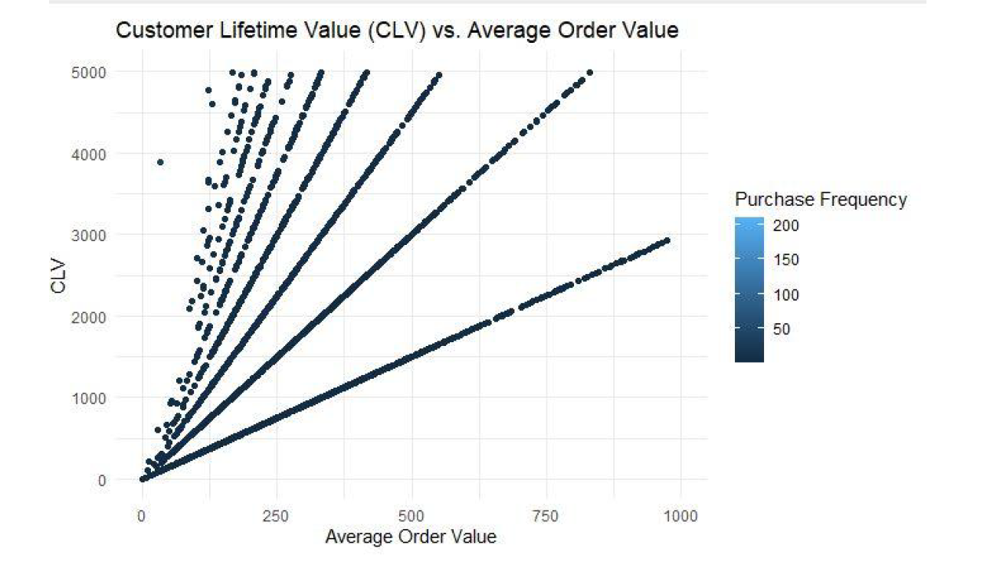
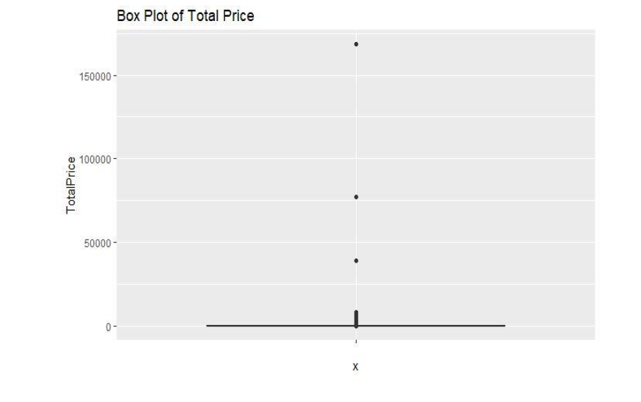
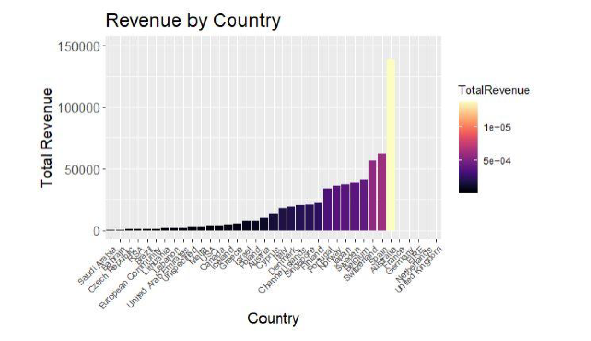
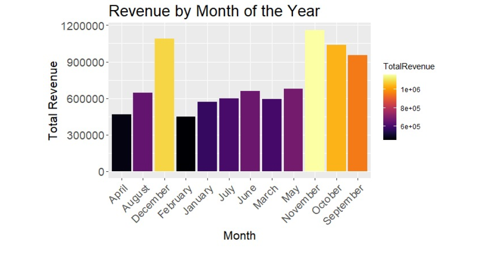
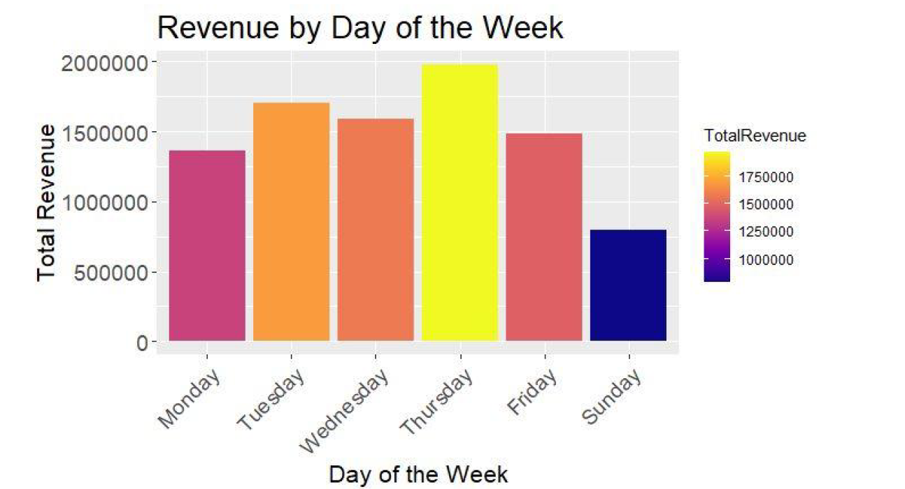
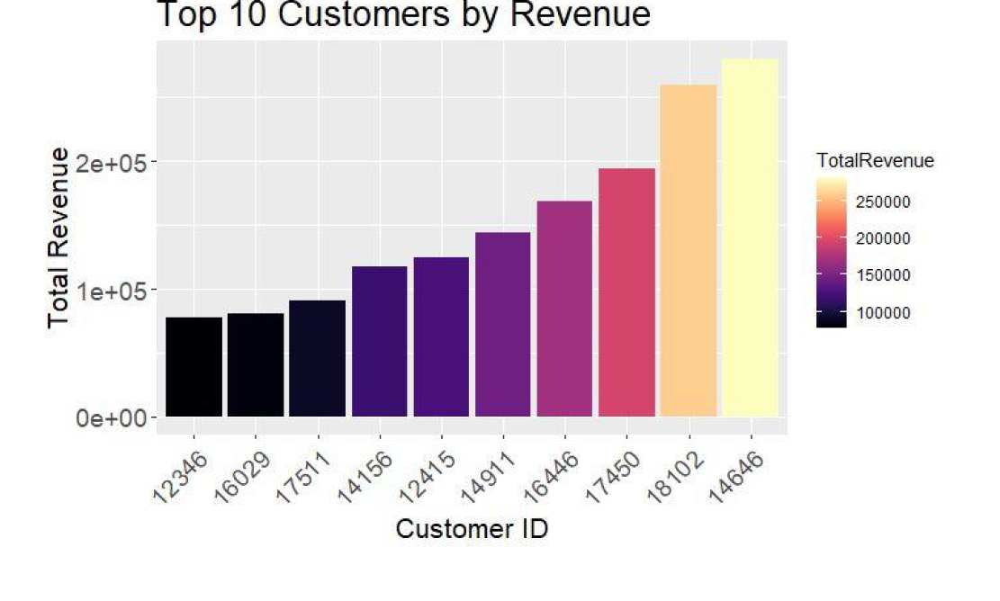
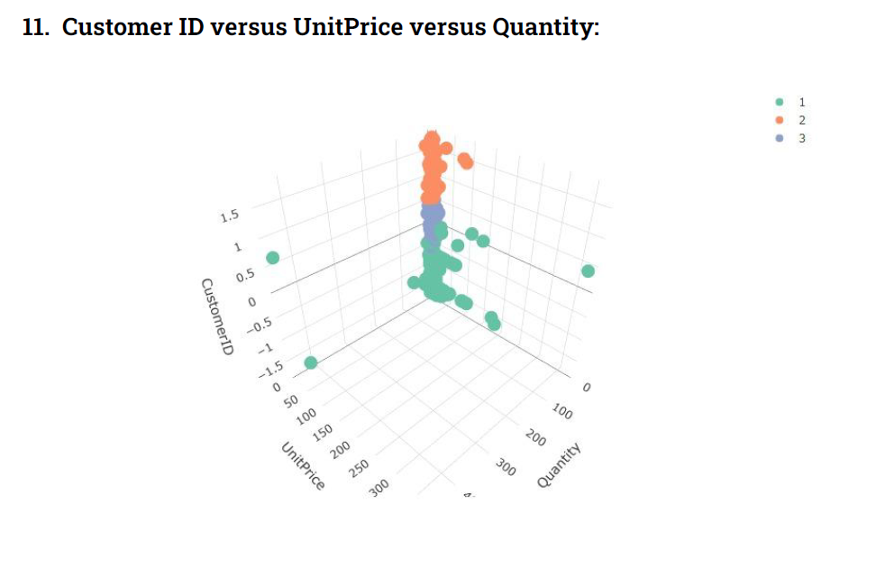

# Data-Science-Project
# Customer Segmentation and Revenue Insights for a Retail Business

## Introduction

This project focuses on analyzing customer behavior and revenue insights using a dataset from a retail company. The primary objective is to understand the dataset, clean it, and employ clustering techniques to segment customers based on their buying behavior. Customer segmentation helps the company tailor its marketing strategies, understand customer preferences, and improve overall business performance.

## Table of Contents

- [Modules Used](#modules-used)
- [Visualizations](#visualizations)
- [Contributing](#contributing)
- [Data Set Link](#data-set-link)
- [Report Link](#report-link)

## Modules Used

1. **Data Cleaning (STEP 1):**
   - Handle missing values
   - Identify and remove canceled invoices
   - Perform other data preprocessing tasks

2. **Feature Extraction (STEP 2):**
   - Extract date-related information
   - Calculate total price
   - Measure description length

3. **RFM Analysis (STEP 3):**
   - Calculate Recency, Frequency, and Monetary (RFM) metrics for each customer
   - Use RFM metrics for customer segmentation and behavior analysis

4. **Exploratory Data Analysis (EDA):**
   - Visualize revenue by country, month, and day of the week
   - Identify top customers by revenue

5. **Market Basket Analysis (Optional):**
   - Identify associations between products often purchased together
   - Improve product recommendations and sales strategies

6. **Customer Segmentation (Clustering):**
   - Use K-means clustering to segment customers based on their behavior
   - Group customers into distinct clusters

7. **Outlier Detection (Optional):**
   - Identify and remove outliers from the dataset

8. **Customer Lifetime Value (CLV):**
   - Calculate Customer Lifetime Value for each customer
   - Gain insights into the long-term value of customers

## Visualizations

1. **Scatter Plot for UnitPrice by Quantity:**
   

2. **Line Plot for Revenue by InvoiceDate:**
   

3. **Bar Plot of CLV by Customer:**
   

4. **Scatter Plot for CLV vs. Average Order Value:**
   

5. **Distribution of TotalPrice (After Removing Outliers):**
   

6. **Revenue by Country:**
   

7. **Revenue by Month:**
   

8. **Revenue by Day of the Week:**
   

9. **Top 10 Customers by Revenue:**
   

10. **3D Scatter Plot of Clusters:**
    

## Contributing

Contributions are welcome! Please fork the repository and create a pull request with your changes. Ensure that your code follows the project's coding standards and includes appropriate tests.

## Data Set Link

## Report Link
https://drive.google.com/file/d/1irrAhszVys2Pd9qgnMTQXNBHxx6mFzA_/view?usp=drivesdk
